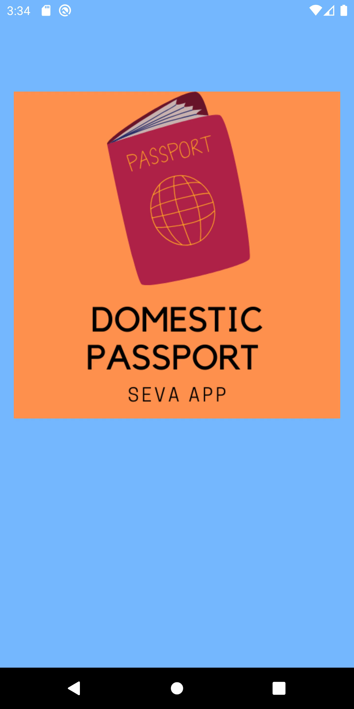
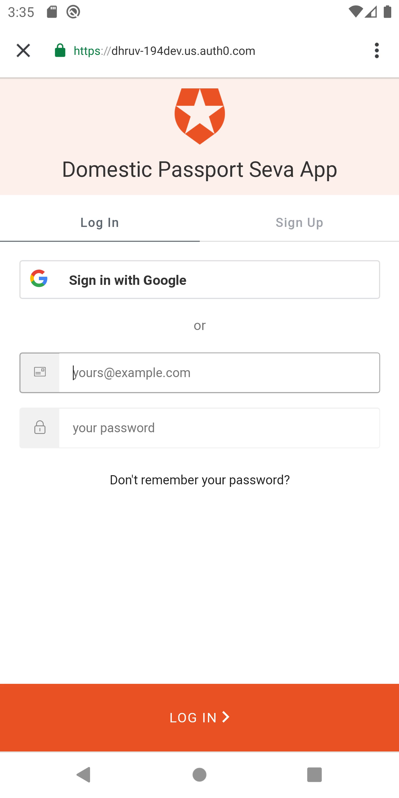
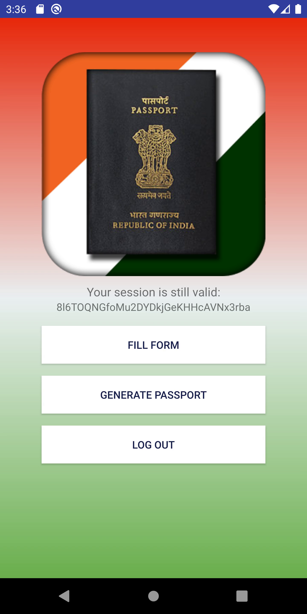
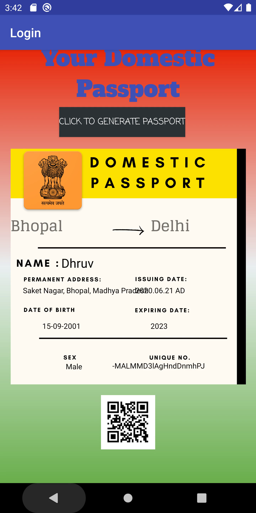

# DOMESTIC PASSPORT SEVA APP

During the lockdown of the ongoing pandemic COVID-19, many migrant workers were forced to leave their jobs and cities where they used to work. They were left stranded on roads and highways nowhere to go but their home/permanent addresses that are their villages and rural districts. State and Central Governments are unanswerable when asked about migrant workers and the problems faced by them. This is because the governments do not have the exact number and amount of migrant workers who are travelling from one city to another, therefore they are unable to arrange facilities for the welfare of these migrant workers. 

Hence, we developed this app ‘Domestic Passport Seva App’, an app inspired by the “Internal Passport System” which is adopted by many countries like China, Russia, North Korea to take a note of their internal migration of citizens. Our app takes in user input from the migrant worker and then gives him an internal passport with a unique number and a QR code which when scanned gives back that Unique number and hence verifies him, therefore lessening the chances of frauds and duplications. The entire login and filling of form is secured by using Auth0 plugins and sdk’s and storing of data is done on Firebase Realtime database. 
This app makes the complex process of registering migrants in a  physical registry easy by adding information to a database. The app asks for two important things - ‘Current City’ the city in which the migrant worker lives and ‘Migrating to City’ the city where he/she lives. This eases the process for the government to help facilitate these hardworking workers when in need during such times of crisis. 

This is just a basic idea which we want the government to follow and make it practical as they did with ‘Aadhaar Card’ . This is in no way a full fledged product ready to be deployed. Just a working prototype of our idea.

Tracks : 
Diversity - helping the diverse groups of migrant workers
General Awareness - giving awareness to the government and the migrant workers by making collection and storing of data in an easy and efficient process. 


# Screenshots - 
	 							 							                                     


# Important Links - 
 - Drive Link : https://drive.google.com/drive/folders/1UllxJf1cAMrvCViJ3rvxu57lv81NKHOO?usp=sharing 
 - Testing Link : https://appetize.io/app/b4ebz119t1qp553ecxaum7q1vr?device=pixel4&scale=75&orientation=portrait&osVersion=10.0   (may/may not work as it is hosted on a third party site kindly check )

# The Official Auth0 documentation used in making this app -
## Login

This sample shows how to authenticate users using Auth0 and obtain their tokens. 

A step by step [Quickstart Tutorial](https://auth0.com/docs/quickstart/native/android/00-login) is provided in our site. If you prefer to skip it and run the sample make sure to [setup](#setup) the project first.

#### Requirements

This sample app runs on Android versions 21 and above.

## Setup

### Auth0 Credentials

The Auth0 SDK needs to know a few details from the Client to correctly display the Login Page. 

Locate the `res/values/strings.xml.example` file in your project resources and remove the `.example` extension. Add the Auth0 Domain and Client ID values present on your [client settings](https://manage.auth0.com/#/clients) page.

Given a Domain value of `"myuser.auth0.com"` and a Client ID value of `"1234567890abcdf"`, the file would look like:

```xml
<resources>
    <!-- ... -->
    <string name="com_auth0_client_id">1234567890abcdf</string>
    <string name="com_auth0_domain">myuser.auth0.com</string>
</resources>
```

### Manifest Placeholders

Locate the `app/build.gradle` file and ensure the `manifestPlaceholder` property is set inside the android defaultConfig object. The `auth0Domain` and `auth0Scheme` placeholders are used internally by the Auth0 SDK to create an Intent Filter that captures the Web Authentication result. 

```groovy
apply plugin: 'com.android.application'
android {
    compileSdkVersion 25
    buildToolsVersion "25.0.3"
    defaultConfig {
        applicationId "com.auth0.samples"
        targetSdkVersion 25
        //...

        //---> Add the next line
        manifestPlaceholders = [auth0Domain: "@string/com_auth0_domain", auth0Scheme: "demo"]
        //<---
    }
}
```

> Important! The manifest placeholders are required for the code to compile.

The placeholders in the snippet make use of the domain we've added in the [previous step](#auth0-credentials) and also hardcode a `"demo"` Url scheme. The scheme value can also be saved in the `strings.xml` file if that's prefered. If we change this value we also need to update the call to the `WebAuthProvider` class where we set the scheme that's going to be used.


### Callback URL

When authentication is requested the sample app will expect a call to the Callback URL with the result of the authentication. This URL is constructed using the values set in the manifest placeholders. In your [client settings](https://manage.auth0.com/#/clients) page, make sure to add under the "Allowed Callback URLs" section a value like the following:

```
{Scheme}://dhruv-194dev.us.auth0.com/android/{ApplicationId}/callback
```

Replace the Scheme, Domain and ApplicationId values with the ones used in your application. Continuing the example from the previous section, the final Callback URL would look like:

```
demo://myuser.auth0.com/android/com.auth0.samples/callback
```

Make sure to click "Save Changes" before leaving the page.
